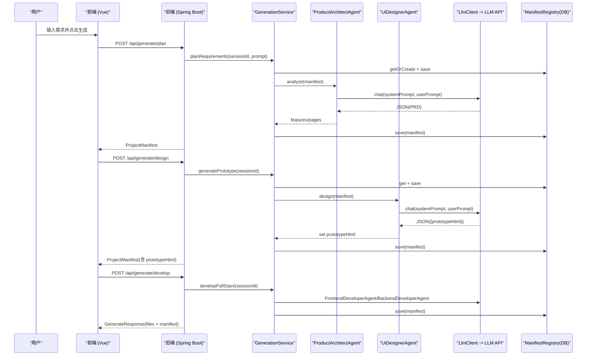

# 生成流程时序图

```mermaid
sequenceDiagram
    participant U as "用户"
    participant FE as "前端 (Vue)"
    participant BE as "后端 (Spring Boot)"
    participant GS as "GenerationService"
    participant PA as "ProductArchitectAgent"
    participant UD as "UiDesignerAgent"
    participant LLM as "LlmClient -> LLM API"
    participant MR as "ManifestRegistry(DB)"
    U ->> FE: 输入需求并点击生成
    FE ->> BE: POST /api/generate/plan
    BE ->> GS: planRequirements(sessionId, prompt)
    GS ->> MR: getOrCreate + save
    GS ->> PA: analyze(manifest)
    PA ->> LLM: chat(systemPrompt, userPrompt)
    LLM -->> PA: JSON(PRD)
    PA -->> GS: features/pages
    GS ->> MR: save(manifest)
    BE -->> FE: ProjectManifest
    FE ->> BE: POST /api/generate/design
    BE ->> GS: generatePrototype(sessionId)
    GS ->> MR: get + save
    GS ->> UD: design(manifest)
    UD ->> LLM: chat(systemPrompt, userPrompt)
    LLM -->> UD: JSON({prototypeHtml})
    UD -->> GS: set prototypeHtml
    GS ->> MR: save(manifest)
    BE -->> FE: ProjectManifest(含 prototypeHtml)
    FE ->> BE: POST /api/generate/develop
    BE ->> GS: developFullStack(sessionId)
    GS ->> LLM: FrontendDeveloperAgent/BackendDeveloperAgent
    GS ->> MR: save(manifest)
    BE -->> FE: GenerateResponse(files + manifest)
```
