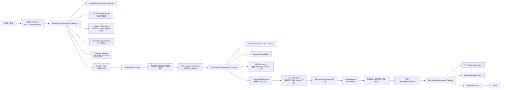

# LingNow 工作流与 Agent 架构说明

## 1. 这套系统本质上是什么

LingNow 不是“用户一句话 -> 大模型一次性吐完整页面”的单轮生成器，而是一个 **以 `ProjectManifest` 为单一事实源（SSOT）的多阶段工作流系统
**。

它的核心目标是：

- 把用户的模糊需求逐步拆成结构化产品定义
- 把结构化产品定义进一步转成可编辑、可审计、可回滚的原型
- 在原型通过质量门后，再进入前后端代码生成与部署产物生成

所以它更接近：

- **Workflow-first 多 Agent 编排系统**
- 而不是强自治、自由协商式的 Agent Network

---

## 2. 核心设计原则

### 2.1 `ProjectManifest` 是全流程单一事实源

所有阶段产物都收敛到 `ProjectManifest`：

- 需求：`userIntent`
- 产品定义：`features` / `pages` / `mindMap` / `taskFlows`
- 契约：`designContract`
- 数据：`mockData`
- 视觉策略：`uxStrategy` / `metaData.visual_*`
- 原型：`prototypeHtml`
- 代码：`generatedFiles` / `dependencies`
- 部署：`deploymentConfig`
- 版本：`snapshots` / `changeLog` / `version`

这让 LingNow 不是靠 prompt 临时拼接，而是靠一份持续演进的工程上下文推进。

---

## 3. 端到端工作流

---

## 4. 前端工作流怎么走

前端入口在 `frontend/src/views/Workbench.vue`，它不是一个简单的表单页，而是一个工作台。

### 4.1 进入系统

- 路由守卫要求登录后访问 `/` 或 `/project/:id`
- 登录页是 `/login`

### 4.2 规划阶段

用户输入一句话后：

1. 前端调用 `POST /api/generate/plan`
2. 后端生成结构化 PRD
3. 前端展示“功能架构”视图
4. 用户可以直接编辑脑图（`mindMap`）

这里非常关键：**设计阶段吃的是“用户确认/修改后的脑图”，不是最原始的 prompt。**

### 4.3 设计阶段

当用户点击开始设计：

1. 前端调用 `POST /api/generate/design`
2. 请求里会携带当前 `mindMap`
3. 后端生成原型 HTML
4. 系统自动跑审计和修复
5. 通过后进入 `QA`
6. 自动创建初始 snapshot

### 4.4 迭代阶段

用户可以继续：

- `POST /api/generate/redesign`：按指令重绘
- `POST /api/generate/snapshot`：保存快照
- `POST /api/generate/rollback`：回滚某一版本

### 4.5 交付阶段

当 `design_ready=true` 时，前端才显示“立即编码交付”：

1. 调用 `POST /api/generate/develop`
2. 后端并行生成前后端文件
3. 再生成部署配置
4. 最终进入 `DONE`

---

## 5. 每个 Agent 的职责

## 5.1 `IndustryIntelligenceAgent`

**角色**：行业战略研究员  
**输入**：`userIntent`  
**输出**：`uxStrategy`

职责：

- 判断产品属于什么行业气质 / benchmark
- 推导壳层模式（`shell_pattern`）
- 推导模块密度、视觉密度、基准产品、核心模块

它解决的问题是：  
**先搞清楚“应该像谁”，再决定页面长什么样。**

---

## 5.2 `ProductArchitectAgent`

**角色**：产品经理 / PRD 架构师  
**输入**：`userIntent` + `uxStrategy`  
**输出**：`archetype` / `overview` / `features` / `pages` / `mindMap` / `taskFlows`

职责：

- 把一句话需求转成结构化产品定义
- 给页面打上 `navType` / `navRole`
- 生成主脑图（只保留主要结构）
- 生成任务闭环（`taskFlows`）
- 自带一次“PRD 自审与 refinement”

它解决的问题是：  
**把模糊需求变成后续阶段可消费的产品结构。**

---

## 5.3 `ManifestContractValidator`

**角色**：跨 Agent 契约规范器  
**输入**：`pages` / `taskFlows` / `mindMap` / `metaData`  
**输出**：标准化后的 `pages` / `taskFlows` / `mindMap` / `designContract`

职责：

- 归一化页面角色、页面类型
- 确保至少存在主页面
- 自动补 detail overlay
- 归一化任务流
- 推导 `designContract`

`designContract` 现在承担的不是文案，而是**工程级设计约束**，比如：

- `contentMode`
- `minPrimaryCards`
- `prefersWaterfallFeed`
- `requiresCategoryTabs`
- `requiresInteractiveFiltering`
- `requiresSearch`
- `requiresComposer`
- `requiresDetailOverlay`

它解决的问题是：  
**避免下游 agent 靠字符串猜语义。**

---

## 5.4 `DataEngineerAgent`

**角色**：数据建模与高保真 mock 数据工程师  
**输入**：`userIntent` / `mindMap` / `pages`  
**输出**：`mockData`

职责：

- 让原型有足够真实的数据可渲染
- 自动补齐封面、头像、分类、话题、位置、互动数、媒体类型等字段
- 在旧 session 上做数据修复（如裂图、假 URL、占位字段）

它解决的问题是：  
**不是只有壳子，而是真有内容生态。**

---

## 5.5 `VisualDNAAgent`

**角色**：视觉系统策略师  
**输入**：`userIntent` / `archetype` / `uxStrategy`  
**输出**：写入 `metaData` 的视觉 token

职责：

- 输出背景、卡片、边框、阴影、字体、字距、行高等视觉 DNA
- 让后续设计阶段不只是“能渲染”，而是有风格方向

它解决的问题是：  
**让页面不是随机长相，而是带有统一的视觉骨骼。**

---

## 5.6 `UiDesignerAgent`

**角色**：原型设计主引擎  
**输入**：`mindMap` / `pages` / `designContract` / `mockData` / `visual DNA`  
**输出**：`prototypeHtml`

职责：

- 先生成 shell（导航、头部、个人区、工具区）
- 再按 route 生成内容 fragment
- 最后拼成完整原型 HTML
- 对高风险场景使用 deterministic fallback，避免生成空壳页

它不是简单模板替换，而是：

1. 先读路由和页面角色
2. 决定用 `ContentFirstShell` 还是 `StandardShell`
3. 再让模型生成各 route 的内容片段
4. 如果模型片段不可靠，就落到安全 fallback

它解决的问题是：  
**把结构化 PRD 真正转成可运行的交互原型。**

---

## 5.7 `FunctionalAuditorAgent`

**角色**：质量门 / 原型验收员  
**输入**：`prototypeHtml` + `designContract` + `taskFlows` + `userIntent`  
**输出**：`AuditOutcome`

职责分两层：

### 硬规则层

做 deterministic 检查，比如：

- HTML 是否为空
- 是否还有未替换占位符
- Alpine 引号是否损坏
- 是否有可点击卡片
- 是否有 detail handoff
- 是否有足够 feed cards
- 是否有 category tabs / interactive filtering
- 是否有重复 header 动作
- 是否泄漏内部语言
- 是否还在用不稳定图片源

### 语义审计层

再调用 LLM 判断：

- 原型是否匹配 archetype
- 是否符合 taskFlows
- 是否符合 designContract

它解决的问题是：  
**不是“看起来生成完了就算完”，而是“过质量门才算设计完成”。**

---

## 5.8 `AutoRepairAgent`

**角色**：自动修复员  
**输入**：当前 HTML + Audit Report + userIntent + mockData  
**输出**：修复后的 HTML

职责：

- 修 HTML 结构
- 修 Alpine 绑定
- 修 hash / detail handoff
- 修字段名和 mockData 键名不一致
- 根据审计报告补洞

工作方式是：

1. 先让 `FunctionalAuditorAgent` 找问题
2. 再让 `AutoRepairAgent` 只修问题，不重做页面
3. 修完以后再次回到审计器验证

它解决的问题是：  
**把“模型容易犯的小错”自动收口，而不是把失败直接甩给用户。**

---

## 5.9 `FrontendDeveloperAgent`

**角色**：前端代码生成器  
**输入**：`ProjectManifest`
**输出**：前端文件 Map

职责：

- 根据产品定义生成 Vue 文件
- 支持已有代码上下文下的增量修改
- 输出前端入口文件和样式文件

---

## 5.10 `BackendDeveloperAgent`

**角色**：后端代码与接口生成器  
**输入**：`ProjectManifest`
**输出**：Java 文件 + `apiSchema` + `databaseSchema`

职责：

- 生成后端文件
- 产出 API Schema
- 产出数据库 Schema

---

## 5.11 `DeploymentAgent`

**角色**：部署产物生成器  
**输入**：`ProjectManifest`
**输出**：Dockerfile / docker-compose / README 部署说明

职责：

- 生成部署配置
- 生成交付 README

---

## 5.12 `ManifestRegistry`

**角色**：持久化总线  
**职责**：

- 读写 `ProjectManifest`
- 按登录用户隔离历史项目
- 持久化快照、版本、设计契约、原型、生成代码等

它保证整个系统不是无状态 prompt 流，而是**可恢复、可回滚、可追踪**的工作流。

---

## 5.13 `LlmClient`

**角色**：统一的大模型调用基础设施  
**职责**：

- 对接 OpenAI-compatible API
- 统一消息格式
- 提供超时和重试

这让所有 Agent 共用一套可控调用层，而不是各自乱连。

---

## 6. 这套工作流是怎么“工作流式”运转的

它不是一堆 Agent 各说各话，而是典型的 **阶段式编排**：

1. **Planning**：理解需求、定结构
2. **Contract Normalize**：把结构变成标准契约
3. **Data + Visual**：补数据、补视觉方向
4. **Design**：产出可运行原型
5. **QA**：验证、修复、再验证
6. **Snapshot / Rollback**：沉淀版本
7. **Coding**：进入前后端代码生成
8. **Deploying**：补部署文档与产物

所以 LingNow 的“多 Agent”强项不是自治，而是：

- **分工清晰**
- **状态明确**
- **输出可追踪**
- **失败可修复**

---

## 7. 怎么保障用户需求尽量准确落地

先说实话：  
工程系统可以大幅提高准确率和一致性，但**不能数学意义上保证“完美”**。  
LingNow 当前的策略是用多层约束，把随机性压低到可控范围。

## 7.1 第一层：先拆需求，不直接画页面

不是 prompt 直接生成 UI，而是先生成：

- archetype
- features
- pages
- taskFlows
- mindMap

这样后面每一步都不是凭空想象。

## 7.2 第二层：把隐式语义变成显式契约

`ManifestContractValidator` 会把需求转成工程可检查的 contract，例如：

- 需要搜索吗
- 需要发布器吗
- 需要 detail overlay 吗
- 需要 category tabs 吗
- 需要 interactive filtering 吗
- 首页至少几张卡片

这样“用户想要内容社区首页”就不再只是 prompt 上的一句话，而会变成明确可验证的约束。

## 7.3 第三层：用户可介入的脑图确认

前端不会在 plan 后直接闷头设计，而是把 `mindMap` 暴露出来给用户编辑。

这一步很关键，因为它让系统有一次人工纠偏机会：

- 用户可以补结构
- 用户可以删错结构
- 用户可以确认系统理解是否偏了

## 7.4 第四层：数据与视觉先行

在设计之前先补：

- `mockData`
- `visual DNA`

这样设计器生成的不是空白 layout，而是带真实数据和明确视觉策略的页面。

## 7.5 第五层：设计后不过 QA 不算完成

设计不是生成 `prototypeHtml` 就结束，而是必须经过：

1. 硬规则审计
2. 语义审计
3. 自动修复
4. 再审一次

只有通过后才会：

- `status = QA`
- `metaData.design_ready = true`

前端也据此决定是否允许进入编码。

## 7.6 第六层：快照、回滚、迭代

哪怕这一版设计通过了，也不是“一次性提交人生”。

系统内建：

- snapshot
- rollback
- redesign

这意味着：

- 做坏了能退
- 局部不满意能改
- 用户需求变化能迭代

## 7.7 第七层：代码生成建立在已通过设计的原型之上

代码生成不是直接从最初 prompt 开始，而是建立在已经过前面所有结构化过程的 `ProjectManifest` 上。

这大大降低了：

- 前后端理解不一致
- 页面与接口脱节
- 需求在代码阶段重新漂移

---

## 8. 为什么说这套系统更像 Workflow，而不是强自治 Agent Network

当前架构里，Agent 之间主要是：

- 串行执行
- 共享同一个 `ProjectManifest`
- 由 `GenerationService` 统一 orchestrate

所以它的优势在：

- 工程稳定
- 容易调试
- 容易做状态控制
- 容易插入质量门和版本管理

而不是：

- 多个 Agent 自主协商
- 冲突博弈
- 长程自治记忆竞争

这不是缺点，而是当下这类产品更现实、更可控的工程选型。

---

## 9. 这套系统当前最重要的保障链条

如果只记一条主线，可以记这个：

> **用户需求 -> 产品结构化 -> 契约化 -> 数据化/视觉化 -> 原型生成 -> 审计 -> 修复 -> 再审 -> 快照 -> 代码生成**

也就是说，LingNow 的关键不是“会不会生成”，而是：

- 是否先理解
- 是否有契约
- 是否能验证
- 是否能修
- 是否能回退

---

## 10. 当前边界与诚实说明

这套系统已经能显著提高需求落地的准确性，但当前仍然有边界：

- 代码生成阶段的自动验证还不如原型阶段那么强
- 多 Agent 仍然是工作流式编排，不是完全自治协作网络
- 行业 benchmark 仍有部分 fallback/default vocabulary，需要继续抽象成更通用能力层
- “完美落地”不能靠一次 LLM 输出保证，仍要依赖 QA、重设计与用户确认

所以更准确的说法是：

> LingNow 通过结构化编排、契约校验、质量门、自动修复和版本回滚，把用户需求“尽量准确、尽量稳定、尽量可控”地落到原型和代码里。

---

## 11. 关键代码位置

### 后端编排

- `backend/src/main/java/cc/lingnow/service/GenerationService.java`
- `backend/src/main/java/cc/lingnow/service/ManifestRegistry.java`
- `backend/src/main/java/cc/lingnow/controller/GenerationController.java`

### 核心 Agent

- `backend/src/main/java/cc/lingnow/service/IndustryIntelligenceAgent.java`
- `backend/src/main/java/cc/lingnow/service/ProductArchitectAgent.java`
- `backend/src/main/java/cc/lingnow/service/ManifestContractValidator.java`
- `backend/src/main/java/cc/lingnow/service/DataEngineerAgent.java`
- `backend/src/main/java/cc/lingnow/service/VisualDNAAgent.java`
- `backend/src/main/java/cc/lingnow/service/UiDesignerAgent.java`
- `backend/src/main/java/cc/lingnow/service/FunctionalAuditorAgent.java`
- `backend/src/main/java/cc/lingnow/service/AutoRepairAgent.java`
- `backend/src/main/java/cc/lingnow/service/FrontendDeveloperAgent.java`
- `backend/src/main/java/cc/lingnow/service/BackendDeveloperAgent.java`
- `backend/src/main/java/cc/lingnow/service/DeploymentAgent.java`

### 前端工作台

- `frontend/src/views/Workbench.vue`
- `frontend/src/router/index.js`
- `frontend/src/views/LoginView.vue`

### 关键模型

- `backend/src/main/java/cc/lingnow/model/ProjectManifest.java`

---

## 12. 一句话总结

LingNow 的核心不是“多 Agent”这三个字本身，而是：

> **把用户需求放进一条可分解、可验证、可修复、可回滚的工程工作流里。**

这才是它真正的产品壁垒和工程价值。

---

## 13. Agent 与工作流变更原则

为了避免系统越改越“会跑但不稳”，后续对 Agent 和工作流的调整建议默认遵循以下原则：

### 13.1 先改结构化契约，再改 prompt

优先级应当是：

1. `ProjectManifest`
2. `designContract`
3. `pages / navRole / navType`
4. `taskFlows`
5. `mockData schema`
6. 最后才是 prompt 文案

原因是：

- prompt 只能提高概率
- 契约能真正约束阶段之间的输入输出

### 13.2 先补质量门，再补 fallback

如果出现“空壳页、裂图、结构跑偏、内部语言泄漏”：

- 第一步应先让 `FunctionalAuditorAgent` 能拦住它
- 第二步再决定是否给 `UiDesignerAgent` 加 deterministic fallback

否则系统只会越来越像“坏结果修补器”，而不是稳定工作流。

### 13.3 通用能力和行业默认值分层

以下能力应尽量抽象成通用机制：

- 登录 / 注册
- 发布
- 搜索
- 分类
- 筛选
- 排序
- 详情页
- 快照 / 回滚

行业只提供：

- benchmark
- 默认分类词
- 布局偏好
- 视觉策略
- 任务流重点

这样系统才不会变成“只会某一个行业”的硬编码生成器。

### 13.4 内部语言不能泄漏到用户页面

内部概念如：

- content-first
- benchmark
- archetype
- workflow
- 结构清晰的内容容器

这些词属于系统脑内语义，不应直接出现在用户可见界面上。

用户页面应该只呈现真实产品语言，而不是系统解释语言。

### 13.5 先看真实渲染结果，再看源码

源码里“有卡片”“有分类”“有详情跳转”并不代表真实可用。

所以评估时应优先关心：

- 页面实际是否渲染出来
- 图片是否可访问
- 分类是否真能过滤
- 搜索是否真能缩小结果集
- 发布 / 登录 / 注册是否真有流程闭环

### 13.6 文档和代码出现偏差时的处理原则

如果架构文档和代码实现不一致：

1. 先明确指出偏差
2. 说明当前线上/当前代码的真实行为
3. 再决定是修文档还是修代码

不应把“历史认知”误当成“当前实现”。
